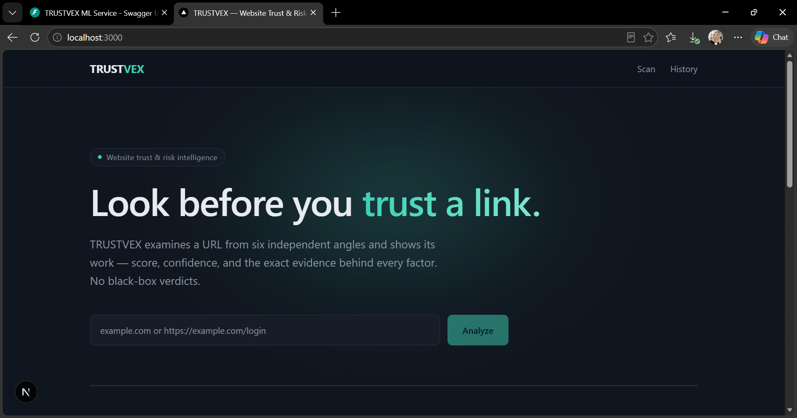
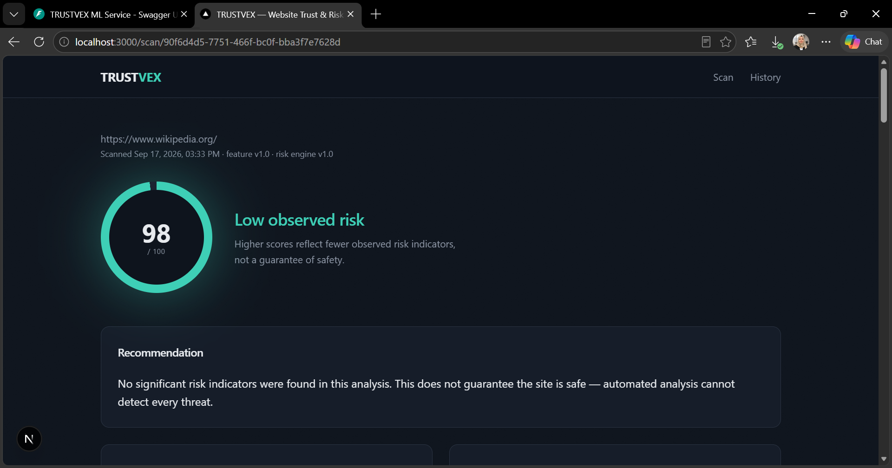
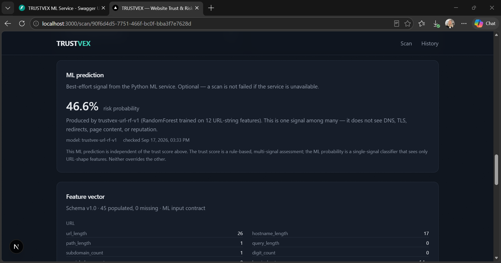
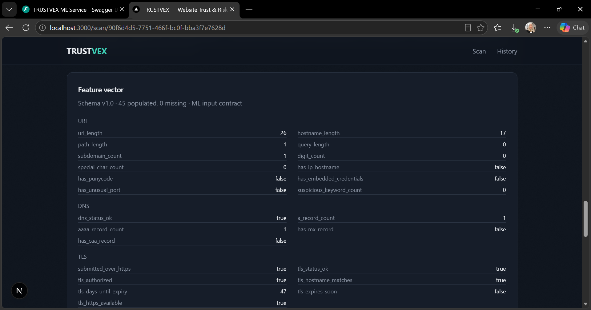
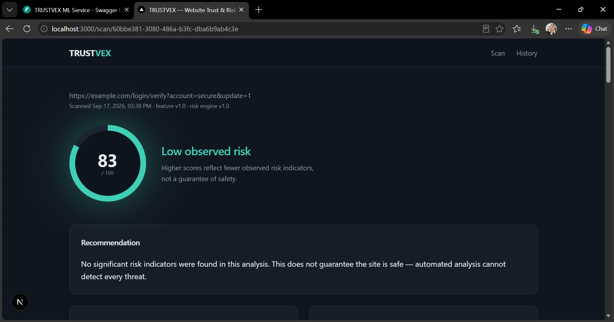
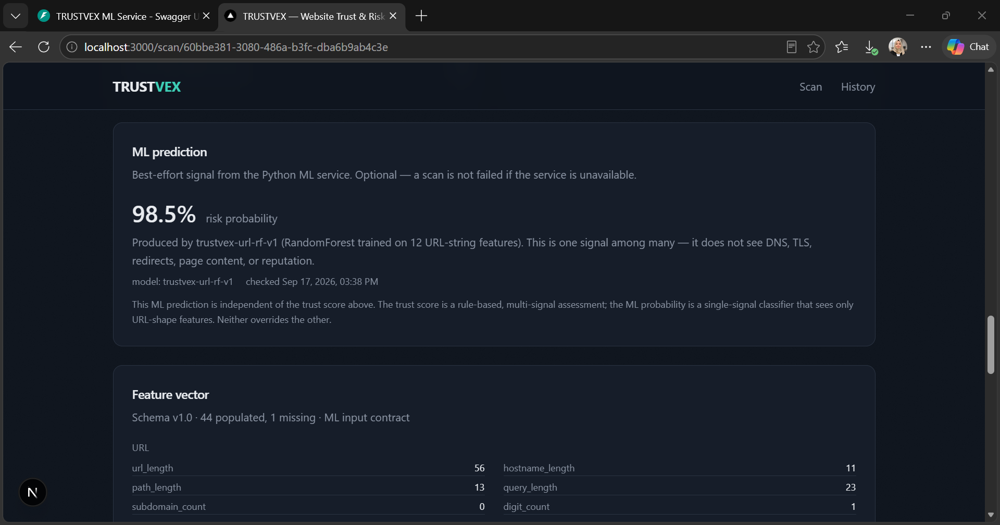
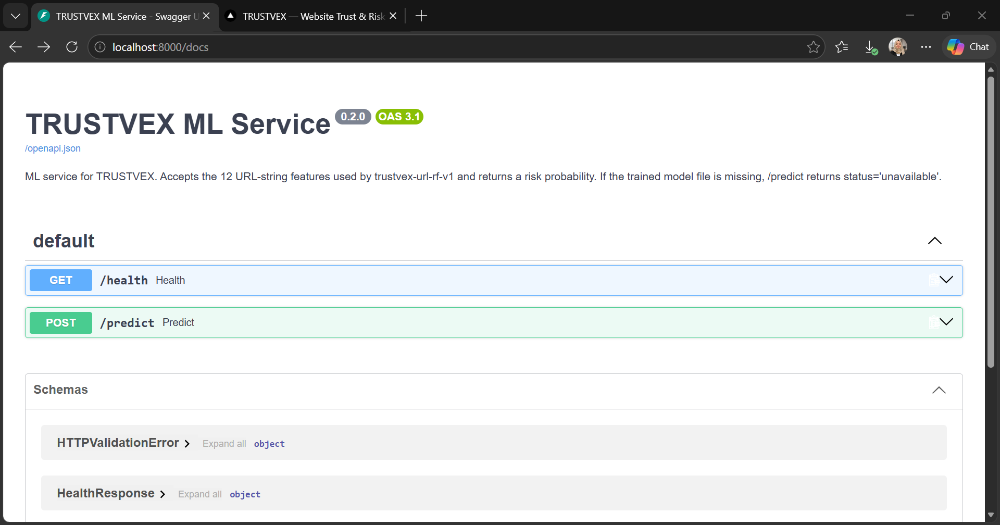
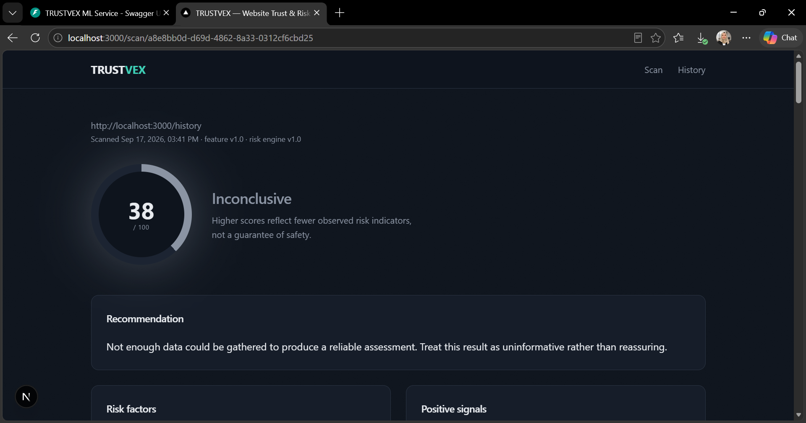

# TRUSTVEX

**Website Trust & Risk Intelligence**

Submit a URL, get an explainable, evidence-based risk report: a 0–100
trust score from a rule engine, an ML risk probability from a trained
RandomForest, and the exact evidence behind every factor. No black-box
verdicts. No "100% safe" claims.

TRUSTVEX combines six independent signal sources, a versioned 45-feature
vector, an explainable rule engine, and a live Python ML microservice —
with every failure mode handled honestly and every claim backed by tests
you can run yourself.

---

## Architecture

```
                          URL
                           │
                           ▼
                    ┌───────────────┐
                    │  Next.js app  │
                    └───────┬───────┘
                            │
                            ▼
                    ┌───────────────┐
                    │  Fastify-style│
                    │  POST /scans  │
                    └───────┬───────┘
                            │
       ┌────────────────────┼────────────────────────┐
       │                    │                        │
       ▼                    ▼                        ▼
  URL analyzer        DNS analyzer             TLS analyzer
       │                    │                        │
       └────────────────────┼────────────────────────┘
                            │
                            ▼
                     Redirect analyzer
                            │
                            ▼
                     Website analyzer
                  (Playwright, headless)
                            │
                            ▼
                    Reputation aggregator
                     (URLhaus, live)
                            │
                            ▼
                     Feature extractor
                     (45 features, v1.0)
                            │
              ┌─────────────┴───────────────┐
              ▼                             ▼
     Rule-based risk engine          Python ML service
     (explainable, versioned)     (RandomForest on 12 URL features)
              │                             │
              └─────────────┬───────────────┘
                            ▼
                    Unified report
                            │
                            ▼
                   SQLite scan history
```

Two processes run side by side: the Next.js scanner (TypeScript) and the
Python ML service (FastAPI). Both degrade gracefully if the other is
unavailable.

---


## Screenshots

### Homepage

The scan form is the entry point. Below it, a visual pipeline shows what
happens during a scan.



### Benign report — Wikipedia

A full scan of a well-known, legitimate site. Trust score 98/100 with a
single LOW risk factor (missing CAA record). Every analyzer at 100%
confidence.



### ML prediction — benign URL

The trained RandomForest returns 46.6% risk probability on a generic URL
shape. The card makes three things explicit: the model version
(`trustvex-url-rf-v1`), the 12 features the model actually sees, and the
fact that this prediction is **independent** of the rule-based trust
score.



### Feature vector

Every scan produces a versioned 45-feature vector, rendered here for
inspection. The `null` convention (missing data ≠ zero) is visible in the
suspicious-URL version further down.



### Suspicious-shaped URL — same domain, different signals

The same rule engine evaluated against a URL shaped like a phishing URL:
`https://example.com/login/verify?account=secure&update=1`. Five
suspicious keywords fire the HIGH risk factor, and the trust score drops
to 83/100.



### ML prediction — suspicious URL

Same model, same 12 features, dramatically different output: **98.5%**
risk probability. This is the ML layer doing something the rule engine
cannot — recognizing that the URL's *feature combination* correlates
with labeled phishing URLs in training data.



### Risk factors and positive signals

The rule engine shows its work: every risk factor carries a severity, a
description, and structured evidence. Positive signals are shown
alongside so the report presents a balanced picture.


### ML service API documentation

The FastAPI microservice auto-generates OpenAPI documentation from the
Pydantic schemas. `/health` reports model availability; `/predict`
accepts the 12-feature vector and returns a probability.



### When the crawler can't reach a target

When the browser crawler can't load a page within its timeout, TRUSTVEX
doesn't guess. The report is marked **INCONCLUSIVE**, confidence drops,
and the reason is shown explicitly. Missing evidence is never treated as
clean evidence.




## What TRUSTVEX actually does

Each scan runs these analyzers in sequence, then feeds their outputs into
two independent risk assessments.

### 1. URL analyzer

Parses the submitted URL. Extracts: protocol, hostname, root domain,
subdomain, path, query, fragment, port, and length measurements. Flags
IP-literal hostnames, punycode-encoded labels, embedded credentials,
non-standard ports, excessive subdomains, and phishing-associated
keywords.

### 2. DNS analyzer

Performs real `A`, `AAAA`, `CNAME`, `MX`, `NS`, `TXT`, and `CAA` lookups
through Node's `dns` module. Never fabricates a record it couldn't
retrieve — a lookup failure is recorded as `status: "error"`, distinct
from `status: "empty"`.

### 3. TLS analyzer

Opens a real TLS connection on port 443 and inspects the certificate:
issuer, subject, validity window, hostname match, trust chain. Reports
whether HTTPS is available at all, whether the certificate is trusted,
and days until expiry. A valid certificate is a positive signal, but is
**never** treated as proof of trustworthiness — phishing sites use
valid HTTPS too.

### 4. Redirect analyzer

Follows the redirect chain manually, hop by hop, re-validating each
destination against SSRF protections. Records every hop's source,
destination, HTTP status, and hostname. Flags excessive chains and
cross-domain redirects.

### 5. Website analyzer

Renders the page in **sandboxed, headless Chromium via Playwright**, not
a regex parse of raw HTML. This sees content injected by client-side
JavaScript — critical for detecting modern phishing kits. Extracts forms,
password fields, login/payment indicators, iframes, external scripts,
and download links from the **rendered DOM**.

Security of the crawler:

- **Every request the page makes** — including subresources and XHR
  calls a malicious page might use to probe internal infrastructure —
  is intercepted and re-validated by `browserSsrfGuard.ts` before
  Chromium sends it.
- **Downloads are disabled** at the context level, and download-shaped
  requests are aborted before they start.
- **The crawler never clicks, types, or submits** — it navigates once
  and reads the resulting DOM.
- **Media and font resources are blocked** — they contribute nothing to
  any trust signal and reduce bandwidth and attack surface.

### 6. Reputation aggregator

Queries **URLhaus** (abuse.ch), a free, nonprofit service tracking URLs
known to distribute malware. As of 2025, abuse.ch requires an API key
called an Auth-Key. Get one free at <https://auth.abuse.ch/>, then set
it in `.env.local`:

```
URLHAUS_ENABLED=true
URLHAUS_API_KEY=your-auth-key-here
```

**What a "no results" answer means:** nothing. It means URLhaus has no
record of this specific URL. It does **not** mean the URL is safe. The
report deliberately avoids treating "no match" as a positive signal.

**What a match means:** the URL is present in URLhaus's database with a
threat classification (e.g. `malware_download`), a status
(`online`/`offline`), and typically a set of tags. TRUSTVEX surfaces all
of this as a HIGH risk factor with a link back to the URLhaus reference
page.

**What a failure means:** if URLhaus times out, rate-limits, or returns
malformed data, TRUSTVEX records the failure and continues the scan. The
report states clearly that the reputation signal is unavailable — it
does **not** default to "clean."

---

## Feature engineering

Every scan produces a **versioned feature vector** — the input contract
for the ML layer.

- **Schema version:** `1.0`
- **Feature count:** **45**
- **Categories:** URL (12), DNS (5), TLS (7), Redirects (3), Website
  (10), Reputation (4), Confidence (2), Risk summary (2)

**Missing-data convention:** a feature is either a measured value
(`0`, `false`, a count) or `null`. We do **not** use `-1` or `0` as a
missing sentinel. This matters because downstream ML must distinguish
"the site measured zero forms" from "we couldn't crawl the site."

The full schema is declared in `src/lib/features/featureSchema.ts`. Every
feature has a stable name, type, category, description, and an explicit
`canBeMissing` flag. Adding or removing a feature requires bumping the
schema version. Old reports keep their original version.

The extractor (`extractFeatures(report): FeatureExtractionResult`) is a
**pure function** — no network, no I/O, no browser. It's tested against
synthetic reports (24 unit tests) and is deterministic by construction.

The feature vector is displayed in the report under "Feature vector," so
you can see exactly what the ML layer consumes.

---

## Rule-based risk engine

The rule engine converts analyzer outputs into a weighted, explainable
trust score.

- Starts at **100** and subtracts points for each observed risk factor
- Each factor has a category, severity, description, impact (points),
  and structured evidence attached
- Produces `LOW_OBSERVED_RISK`, `MODERATE_OBSERVED_RISK`,
  `ELEVATED_OBSERVED_RISK`, `HIGH_OBSERVED_RISK`, or `INCONCLUSIVE`
- When too few analyzers succeed, the report is marked `INCONCLUSIVE`
  regardless of the numeric score
- Thresholds and weights are declared in `src/lib/riskConfig.ts` and
  versioned

**Every risk factor carries its evidence.** No black-box verdicts.

---

## ML prediction service

The feature vector's **12 URL-string features** are sent to a Python
FastAPI microservice that runs a trained RandomForest classifier.

### Model

- **Algorithm:** `sklearn.ensemble.RandomForestClassifier`
- **n_estimators:** 200
- **max_depth:** None (trees grow to full depth; bagging handles overfitting)
- **class_weight:** balanced
- **random_state:** 42
- **n_jobs:** -1

No hyperparameter tuning. One frozen configuration. The test-set metrics
are the headline numbers.

### Training data

- **Source:** Kaggle `taruntiwarihp/phishing-site-urls` CSV
- **Original rows:** 549,346 valid (15 malformed rows dropped)
- **After canonicalization:** 156,415 phishing / 392,904 benign
- **After exact-URL dedup:** 113,502 phishing / 392,854 benign
- **After per-class cap (20,000):** 20,000 / 20,000
- **After 70/15/15 grouped split:** 27,193 train / 6,345 val / 6,462 test

**Labels are inherited from the third-party dataset.** TRUSTVEX does
**not** independently verify them. Throughout the code and docs they are
called "labeled phishing (per source)" and "labeled non-phishing (per
source)," never "confirmed" or "verified."

The split is **grouped by registrable domain**, using the Public Suffix
List. Every URL belonging to a domain goes entirely into train, val, or
test — never across. This tests generalization to unseen domains, which
is what matters for a URL classifier. It is **not** a temporal split.

### Measured test-set metrics

Computed on the held-out test split after training:

```
n:              6,462
precision:      0.610
recall:         0.725
f1:             0.663
roc_auc:        0.774
```

**These are mediocre numbers, reported honestly.**

- **Precision 0.61** — 61% of URLs the model flags as phishing are
  actually labeled phishing in the test set. That's 39% false positives.
- **Recall 0.72** — the model catches 72% of labeled phishing URLs.
- **Validation F1 was 0.73 vs. test F1 0.66** — a 7-point gap that
  indicates some overfitting to the validation domain distribution,
  despite the grouped split.

Feature importances from the trained model:

```
digit_count:                0.210
path_length:                0.182
url_length:                 0.172
suspicious_keyword_count:   0.135
hostname_length:            0.134
query_length:               0.063
subdomain_count:            0.051
special_char_count:         0.035
has_ip_hostname:            0.018
has_punycode:               0.000
has_embedded_credentials:   0.000
has_unusual_port:           0.000
```

Three features — `has_punycode`, `has_embedded_credentials`,
`has_unusual_port` — had essentially zero importance on this dataset.
The model learned that phishing URLs are mostly long, digit-heavy,
keyword-stuffed URL shapes. That's a real, documented property of the
training distribution.

**A v2 would need:** additional URL-shape features with discriminative
power, the full dataset instead of a 20k cap, and possibly XGBoost or a
gradient-boosting approach.

### How the ML result is used

- **Best-effort.** The ML call has a 5-second timeout. If the service is
  unreachable, slow, or errors, the scan completes normally and the
  report shows "ML service unavailable" with the reason.
- **Never affects the risk score.** The rule score comes from the
  analyzers and risk engine. The ML probability is a separate,
  independent signal.
- **Displayed independently** in the report. No blending, no fusion.
  The report says: "This ML prediction is independent of the trust
  score above. The trust score is a rule-based, multi-signal assessment;
  the ML probability is a single-signal classifier that sees only
  URL-shape features. Neither overrides the other."

The report's ML card shows the model version, the probability, the
timestamp, and a plain-language explanation of what the model can and
cannot see.

---

## Security engineering

Every scan target is treated as hostile input. TRUSTVEX has two
independent SSRF defense layers plus several other safeguards.

### SSRF protection — HTTP client layer

Every outbound HTTP request resolves DNS through a guard that blocks
private, loopback, link-local, and reserved addresses. This check is
re-run at **connect time** for every hop of a redirect chain, not just
once up front — closing the classic DNS-rebinding window.

IP-literal targets (`http://192.168.1.1`) are checked directly. Node
skips custom DNS resolution entirely for already-IP hostnames, so the
guard must run explicitly. This was a real bug caught during testing
and is now covered by `assertHostnameSafeIfLiteralIp()` in
`src/lib/security/ssrfGuard.ts`.

### SSRF protection — browser routing layer

Playwright/Chromium doesn't expose a hook for custom DNS resolution. So
instead, every request the page makes is **intercepted** before Chromium
sends it and re-validated against the same block list. This includes
main documents, scripts, iframes, and XHR calls from page JavaScript.

**Documented limitation:** there is a TOCTOU window between our
interception-time DNS resolution and Chromium's own connection. This is
the same class of DNS-rebinding race the HTTP-layer guard closes for
plain requests, but it cannot be fully closed for a browser engine we
don't control the socket layer of. For a hardened deployment, pair this
with network-level egress controls around the container the browser
runs in.

### Other safeguards

- **Rate limits and timeouts** on every outbound request
- **Response size caps** (2 MB body limit)
- **Redirect caps** (8 hops maximum)
- **No credential submission** — the crawler never enters or submits
  form data
- **No payment interaction** — the crawler never touches payment flows
- **No downloading of executables or archives** — download-shaped
  requests are aborted

---

## Running TRUSTVEX

### Requirements

- **Node.js 20+**
- **Python 3.10+**
- **Playwright Chromium** (`npx playwright install chromium`)

### First-time setup

```bash
# 1. Install Node dependencies
npm install

# 2. Install Playwright's Chromium binary
npx playwright install chromium

# 3. Set up the Python environment
python -m venv ml/.venv
ml/.venv/Scripts/activate          # Windows
# source ml/.venv/bin/activate     # macOS/Linux

# 4. Install Python dependencies
pip install -r ml/requirements.txt

# 5. Configure URLhaus (optional but recommended)
copy .env.example .env.local
# then edit .env.local and add your URLHAUS_API_KEY
```

### Running

Two processes run side by side.

**Terminal 1 — Python ML service:**

```bash
cd C:\Users\ADMIN\Desktop\trustvex\trustvex
ml\.venv\Scripts\activate
uvicorn ml.service.main:app --reload --port 8000
```

**Terminal 2 — Next.js app:**

```bash
cd C:\Users\ADMIN\Desktop\trustvex\trustvex
npm run dev
```

Open <http://localhost:3000>, enter a URL, watch the report render.
Scan results persist across restarts (SQLite file lives in `data/`).

**If the ML service isn't running**, TRUSTVEX still scans normally. Every
report's ML section shows "unavailable" with the reason.

### Environment variables

See `.env.example`. All optional:

- `URLHAUS_ENABLED` — `true` (default) or `false`
- `URLHAUS_API_KEY` — your abuse.ch Auth-Key
- `ML_ENABLED` — `true` (default) or `false`
- `ML_SERVICE_URL` — defaults to `http://localhost:8000`

### Retraining the ML model

```bash
# From the project root, venv active.
# 1. Download the Kaggle phishing-site-urls dataset manually, unzip, and
#    place the CSV at ml/datasets/raw/kaggle-phishing-site-urls.csv
# 2. Inspect + hash:
python ml/datasets/download.py
# 3. Prepare the dataset:
python ml/datasets/prepare.py
# 4. Train the model:
python ml/training/train.py
# 5. Restart the FastAPI service; it will pick up the new model.
```

Every run writes a manifest recording the actual row counts, filter
counts, class distribution, and file hashes. Reproducing the model
requires the same CSV, the same seed (42), and the same code.

---

## Testing

```bash
# Node tests
npm test

# TypeScript typecheck
npm run typecheck

# ESLint
npm run lint

# Python tests
ml\.venv\Scripts\activate
python -m pytest ml/tests ml/datasets/tests -v
```

**Current test count:** 53 Node tests + 18 Python dataset tests + 12
Python service tests = **83 tests**, all passing.

**No test makes a live network call.** Reputation tests use hand-authored
response stubs; dataset tests use synthetic fixtures; ML client tests
stub `fetch`; the FastAPI tests use `TestClient` with the ASGI app.

---

## Project structure

```
trustvex/
├── src/                                   # Next.js application
│   ├── app/
│   │   ├── page.tsx                       # homepage / scan form
│   │   ├── scan/[id]/page.tsx             # full report view
│   │   ├── history/page.tsx               # scan history list
│   │   └── api/scans/                     # POST create, GET list/detail
│   ├── components/                        # ScoreDial, SectionCard, FactorList
│   └── lib/
│       ├── analyzers/                     # url, dns, tls, redirect, website
│       ├── browser/                       # Playwright singleton manager
│       ├── features/                      # 45-feature schema + extractor
│       ├── ml/                            # Node → Python ML client
│       ├── reputation/                    # provider registry + providers/
│       │   ├── provider.ts                # interface
│       │   ├── registry.ts                # registry + timeout wrapper
│       │   └── providers/
│       │       ├── fixture.ts             # test-only
│       │       └── urlhaus.ts             # live provider
│       ├── security/                      # ssrfGuard, safeFetch, browserSsrfGuard
│       ├── riskEngine.ts                  # rule-based scoring
│       ├── riskConfig.ts                  # thresholds, weights, versions
│       ├── scanService.ts                 # orchestrates one scan
│       ├── db.ts                          # SQLite persistence
│       └── types.ts                       # shared report types
│
├── ml/                                    # Python ML service
│   ├── service/
│   │   ├── main.py                        # FastAPI app
│   │   ├── predictor.py                   # model loader + inference
│   │   └── schemas.py                     # request/response models
│   ├── datasets/
│   │   ├── download.py                    # inspect + hash the CSV
│   │   ├── prepare.py                     # canonicalize, dedup, split
│   │   ├── FEATURE_CONTRACT.md            # 12-feature spec
│   │   ├── sources.json                   # provenance
│   │   ├── tests/                         # 18 unit tests
│   │   └── raw/                           # downloaded data (gitignored)
│   ├── training/
│   │   ├── train.py                       # RandomForest training
│   │   └── README.md
│   ├── models/                            # trained artifacts (gitignored)
│   │   └── trustvex_url_rf_v1.joblib
│   ├── tests/                             # 12 service tests
│   ├── requirements.txt
│   └── README.md
│
├── data/                                  # SQLite database (gitignored)
├── .env.example
└── README.md
```

---

## Scope & roadmap

Everything the original target architecture called for is either built
or explicitly deferred. Nothing is pretending.

**Complete:**

1. ✅ Full analyzer pipeline (URL, DNS, TLS, redirects, Playwright)
2. ✅ SSRF protections at HTTP client and browser routing layers
3. ✅ Rule-based risk engine with explainable evidence
4. ✅ 45-feature versioned schema with pure extractor
5. ✅ Reputation provider architecture
6. ✅ URLhaus live integration with API-key auth
7. ✅ Python ML service with FastAPI
8. ✅ Node ↔ Python integration with graceful fallback
9. ✅ Reproducible dataset pipeline
10. ✅ Trained RandomForest with measured metrics
11. ✅ Live model serving in the running app

**Documented future directions** (not required for completeness):

1. **Background job queue (BullMQ + Redis)** — scans currently run
   synchronously. For concurrent load, move to a worker queue with
   retry/backoff, and surface progress via SSE or polling.
2. **PostgreSQL + Prisma** — swap SQLite once concurrent writers,
   migrations, or multi-instance deployment are needed.
3. **Domain intelligence (WHOIS/RDAP)** — registration date, registrar,
   nameserver history. Requires a chosen provider and API key.
4. **A stronger ML model** — the current v1 uses only 12 URL-shape
   features and reports F1 0.66. A v2 would add discriminative features,
   use the full dataset (not a 20k cap), and evaluate on a temporal
   holdout.
5. **Fusion of rule score and ML probability** — currently displayed
   independently. A documented calibration/fusion method could combine
   them, but that requires a proper validation set and is not trivial.
6. **Auth, rate limiting, Docker, CI/CD, Prometheus/Grafana** —
   appropriate once this is a multi-user deployment.

---

## Honesty notes (on purpose, not by accident)

- **Risk levels are named `LOW/MODERATE/ELEVATED/HIGH_OBSERVED_RISK` or
  `INCONCLUSIVE`.** Never "safe" or "malicious." Automated analysis
  cannot guarantee either.
- **A valid HTTPS certificate is not proof of trustworthiness.** It's
  shown as a positive signal but explicitly noted as insufficient.
  Malicious sites use HTTPS too.
- **A URLhaus "no results" answer is not a positive signal.** It means
  the provider has no record of that URL, not that the URL is safe.
- **When a data source fails** (DNS timeout, unreachable page, TLS
  handshake failure), the report says so and lowers confidence. It does
  not silently treat missing data as "clean."
- **The ML model's metrics are reported verbatim.** Precision 0.61,
  recall 0.72, F1 0.66, ROC-AUC 0.77 — mediocre numbers, honestly
  stated. No cherry-picking, no "up to X% accuracy" language.
- **Dataset labels are inherited from a third-party source.** TRUSTVEX
  does not independently verify them, and every downstream artifact
  says so.
- **The root-domain extraction in the URL analyzer** is a simplified
  two-label heuristic, not a full Public Suffix List implementation. It
  will be wrong for domains like `example.co.uk`. The Python pipeline
  uses the real PSL; the TypeScript side will catch up in a future
  milestone.
- **The browser crawler has a documented TOCTOU window** between our
  request-interception DNS check and Chromium's own connection. This is
  noted in `browserSsrfGuard.ts` and in the security section above.

---

## License

Personal portfolio project. See individual dependencies for their own
licenses. The Kaggle training dataset is not redistributed — see
`ml/datasets/sources.json` for provenance.
```

---

